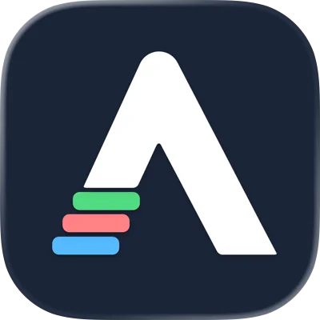
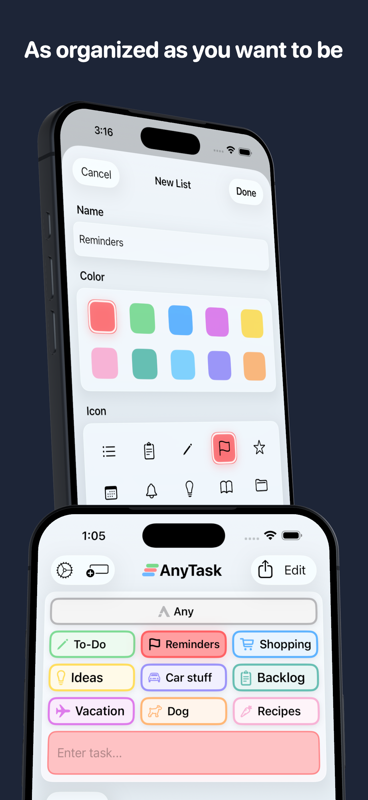
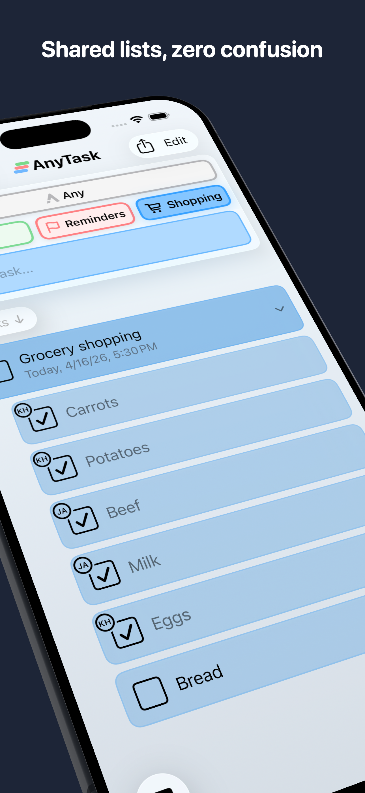
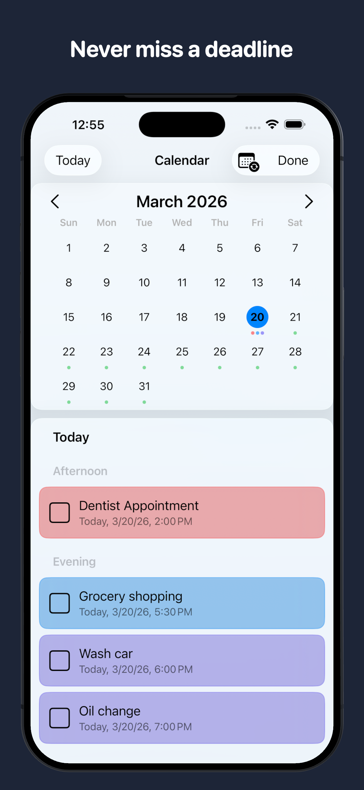

# AnyTask

### Capture first. Sort later.

**A task manager for people tired of overdesigned productivity systems.**

[Website](https://anytaskapp.com) · [Changelog](https://anytaskapp.com/changelog) · [Privacy](https://anytaskapp.com/privacy)

 

---

## As organized as you want to be

Create lists in seconds. Give them a color, an icon, and only the structure they need. Add subtasks, notes, photos, links, and due dates. Drag tasks between lists — no rules, no rigid project hierarchies.

  

## Shared lists, zero confusion

Share any list with family, friends, or coworkers over iCloud. Real-time sync. No accounts, no invites, no extra apps. Tap two iPhones together to share via NFC.

  

## Never miss a deadline

Type dates inline the way you'd say them — "Tuesday @2pm" — and AnyTask understands. Set reminders, repeat tasks, and see everything in a calendar view that syncs with Apple Calendar.

  

## iPhone, iPad, and Mac

Native on every Apple device. Home Screen and Lock Screen widgets, Siri, Apple Shortcuts, and full offline support. Everything syncs automatically over iCloud.

  

---

## FAQ

<b>How much does AnyTask cost?</b>

Free to try for 10 days. After that, $1.99/month or $11.99/year as in-app purchases.

<b>What devices does AnyTask work on?</b>

iPhone, iPad, and Mac. Everything syncs automatically over iCloud.

<b>Can I share lists with family or coworkers?</b>

Yes — any list can be shared with other iCloud users in real time. You can also tap two iPhones together to share via NFC.

<b>Does AnyTask have reminders?</b>

Yes. Due dates, recurring tasks, early reminders, and full Apple Calendar sync.

<b>Does AnyTask have widgets?</b>

Yes — Home Screen and Lock Screen widgets are included.

<b>How is AnyTask different from Apple Reminders?</b>

Inspired by Reminders but built to go further. AnyTask adds an "Any" inbox, a Lock Screen widget, Sort mode, drag-and-drop on every list, and inline natural-language dates.

<b>Does AnyTask work offline?</b>

Yes. Create, edit, and complete tasks offline. Shared lists sync the moment you reconnect.

<b>Does AnyTask support Siri and Shortcuts?</b>

Yes — full Siri support and a complete set of Apple Shortcuts actions.

<b>Is my data private?</b>

AnyTask does not collect or store your personal data on any servers — there are no servers. Everything lives in your own iCloud.

---

## Compare

- [vs Apple Reminders](https://anytaskapp.com/vs/apple-reminders)
- [vs Things 3](https://anytaskapp.com/vs/things-3)
- [vs Todoist](https://anytaskapp.com/vs/todoist)
- [vs Any.do](https://anytaskapp.com/vs/any-do)

## Built for

- [ADHD](https://anytaskapp.com/for/adhd)
- [Families](https://anytaskapp.com/for/families)
- [Students](https://anytaskapp.com/for/students)

---

Built by <a href="https://github.com/Kyle-Hosman">Kyle Hosman</a> · <a href="https://anytaskapp.com">anytaskapp.com</a>

© 2026 AnyTask. Not affiliated with AnyTask.com or AnyTasks.io.

