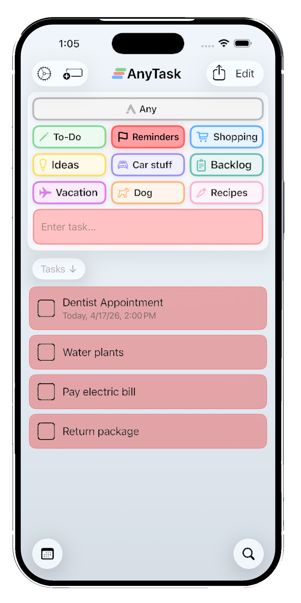
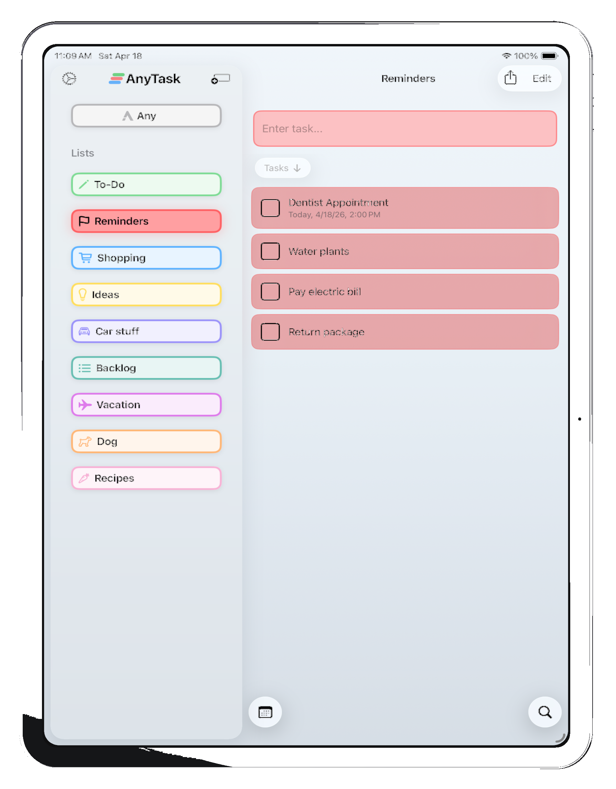
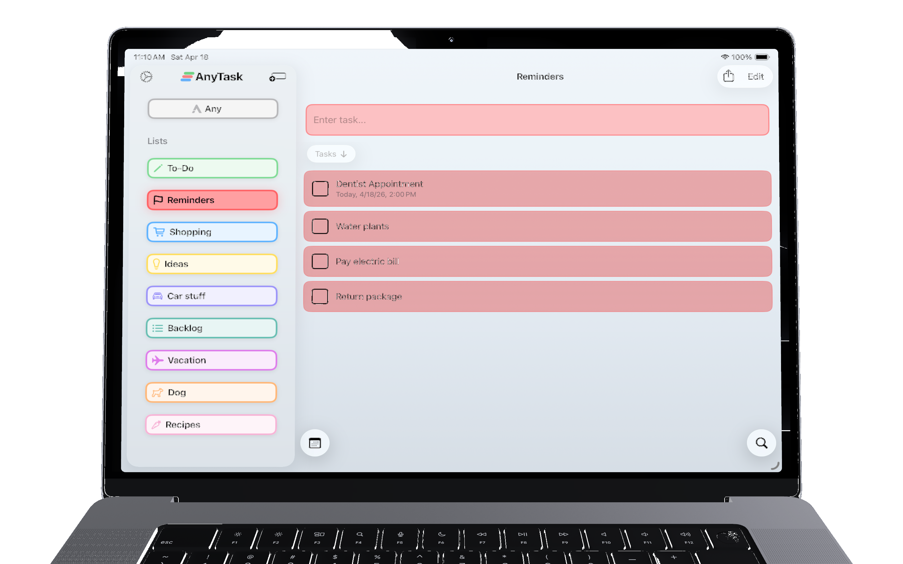

# AnyTask

**Make a list. Set a reminder.
Share it instantly.**
 
*The effortless way to organize tasks for yourself and anyone you want to share lists with.*

[Website](https://anytaskapp.com) · [Changelog](https://anytaskapp.com/changelog) · [Privacy](https://anytaskapp.com/privacy)

 

---

## Sort tasks into lists in seconds

Capture everything in your "Any" inbox the moment it pops into your head. Later, pick a list and tap to file each task where it belongs. Clearing your mind has never been faster.

  

## As organized as you want to be

Organize tasks into customizable lists with your own colors and icons. Add subtasks, attach photos and links, and set due dates. Drag and drop between lists — or sort straight from your Any inbox — for quick weekly planning or clearing a backlog. Already use Apple Notes? Import your existing checklists in a tap.

  

## Share lists with anyone

Collaborate with family, friends, or coworkers through seamless iCloud sharing. Lists stay in sync across everyone's devices in real time.

  

## Never miss a deadline

Type the date inline — "Tuesday @2pm" — and AnyTask parses it as you go. Get reminders when tasks are due, set recurring tasks on any schedule, and sync with Apple Calendar for a unified view of your day.

  

## iPhone, iPad, and Mac

Native on every Apple device. Full offline support, Siri, Apple Shortcuts, and automatic iCloud sync — start a task on one device, finish it on another.

  
  
  

---

## FAQ

<b>What devices does AnyTask work on?</b>

iPhone, iPad, and Mac. Everything syncs automatically over iCloud.

<b>Can I share lists with family or coworkers?</b>

Yes — any list can be shared with other iCloud users in real time. You can also tap two iPhones together to share via NFC.

<b>Does AnyTask have reminders?</b>

Yes. Due dates, recurring tasks, early reminders, and full Apple Calendar sync.

<b>Does AnyTask have widgets?</b>

Yes — Home Screen and Lock Screen widgets are included.

<b>How is AnyTask different from Apple Reminders?</b>

Inspired by Reminders but built to go further. AnyTask adds an "Any" inbox, a one-tap to input tasks Lock Screen widget, Sort mode, drag-and-drop on every list, and inline natural-language dates.

<b>Does AnyTask work offline?</b>

Yes. Create, edit, and complete tasks offline. Shared lists sync the moment you reconnect.

<b>Does AnyTask support Siri and Shortcuts?</b>

Yes — full Siri support and a complete set of Apple Shortcuts actions.

<b>Is my data private?</b>

AnyTask does not collect or store your personal data on any servers — there are no servers. Everything lives in your own iCloud.

---

## Compare

- [vs Apple Reminders](https://anytaskapp.com/vs/apple-reminders)
- [vs Things 3](https://anytaskapp.com/vs/things-3)
- [vs Todoist](https://anytaskapp.com/vs/todoist)
- [vs Any.do](https://anytaskapp.com/vs/any-do)

## Built for

- [Families](https://anytaskapp.com/for/families)
- [Students](https://anytaskapp.com/for/students)
- [ADHD](https://anytaskapp.com/for/adhd)

---

Built by <a href="https://github.com/Kyle-Hosman">Kyle Hosman</a> · <a href="https://anytaskapp.com">anytaskapp.com</a>

© 2026 AnyTask. Not affiliated with AnyTask.com or AnyTasks.io.

