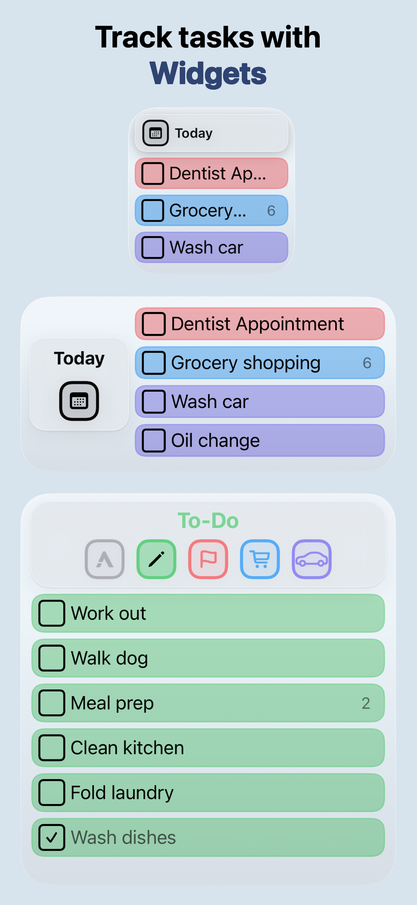

# AnyTask

**A native task manager for iPhone, iPad, and Mac. Capture first. Sort later.**

[Website](https://anytaskapp.com) · [Download on the App Store](https://apps.apple.com/us/app/anytask-reminders-calendar/id1493596172) · [Report an issue](https://github.com/Kyle-Hosman/AnyTask/issues/new/choose) · [Changelog](./CHANGELOG.md)

This repository is the public home for AnyTask: a place to file bug reports, request features, browse changelogs, and find resources like Apple Shortcuts and the press kit. The app itself is closed-source.

  

---

## What is AnyTask?

AnyTask is a fast, native task and reminders app for the Apple ecosystem, built for people frustrated with overly complex productivity tools. It syncs across iPhone, iPad, and Mac via iCloud, with no account required.

### Features

**Organize**
- Custom lists with colors and icons
- Subtasks, notes, photo and link attachments
- Drag-and-drop reordering
- Quick search and filters

**Schedule**
- Natural language date parsing (e.g. "Tuesday @2pm")
- Recurring tasks
- Reminders with early notifications (15 minutes to 1 day before due)
- Calendar view synced with Apple Calendar

**Share**
- Real-time shared lists via iCloud — no account needed
- NFC tap-to-share between iPhones
- Live sync across all devices

**Works Everywhere**
- iPhone, iPad, and Mac
- Home Screen and Lock Screen widgets
- Siri and Apple Shortcuts integration
- Import from Apple Notes
- Dark Mode and larger text accessibility support
- Fully functional offline

## Screenshots

<table>
  <tr>
    <td align="center"> <b>Customize</b></td>
    <td align="center"> <b>Collaborate</b></td>
    <td align="center"> <b>Calendar</b></td>
    <td align="center"> <b>Widgets</b></td>
  </tr>
</table>

## Pricing

Free to download with a 10-day trial of AnyTask Pro. After that:

- **Monthly:** $1.99
- **Yearly:** $11.99

## Requirements

iOS 18.2 or later. Available on iPhone, iPad, and Mac.

## Get in Touch

- **Bug reports and feature requests:** [open an issue](https://github.com/Kyle-Hosman/AnyTask/issues/new/choose)
- **General support:** see [anytaskapp.com](https://anytaskapp.com)
- **Privacy policy:** [anytaskapp.com/privacy](https://anytaskapp.com/privacy)

## About the Developer

AnyTask is built by [Kyle Hosman](https://github.com/Kyle-Hosman), an independent developer. The app is written in SwiftUI for the Apple platform.

---

© 2026 Kyle Hosman. AnyTask is a trademark of Kyle Hosman.
